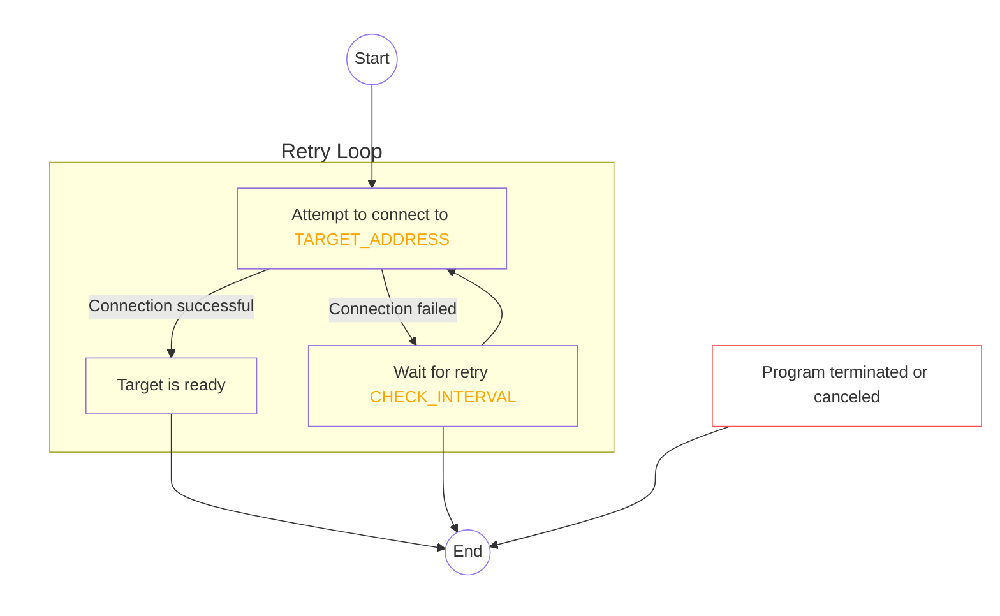
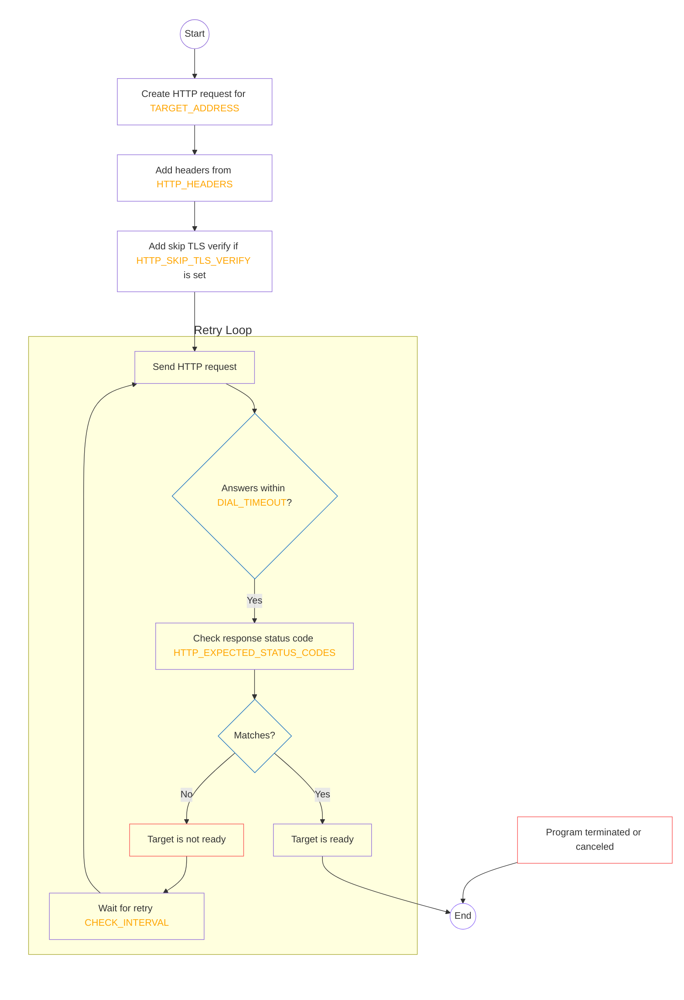
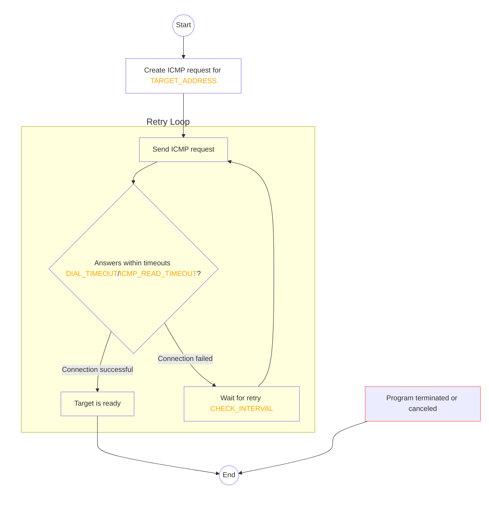

<p align="center">
  
</p>

# PortPatrol

`PortPatrol` is a simple Go application that checks if a specified `TCP`, `HTTP` or `ICMP` target is available. It continuously attempts to connect to the specified target at regular intervals until the target becomes available or the program is terminated. Intended to run as a Kubernetes initContainer, `PortPatrol` helps verify whether a dependency is ready. Configuration is managed through environment variables; for more details, refer to the [Environment Variables](#EnvironmentVariables) section."

## Command-Line Flags

`PortPatrol` accepts the following command-line flags:

### Common Flags

| Flag                  | Type     | Default | Description                                                                                   |
|-----------------------|----------|---------|-----------------------------------------------------------------------------------------------|
| `--default-interval`  | duration | `2s`    | Default interval between checks. Can be overridden for each target.                           |
| `--debug`             | bool     | `false` | Enable logging of additional fields.                                                         |
| `--version`           | bool     | `false` | Show version and exit.                                                                        |
| `--help`, `-h`        | bool     | `false` | Show help.                                                                                    |

### Target Flags

Use the `--<TYPE>.<IDENTIFIER>.<PROPERTY>=<VALUE>` format to define targets.
Types are: `http`, `icmp` or `tcp`.

#### HTTP-Flags

- **`--http.<IDENTIFIER>.name`** = `string`
  The name of the target. If not specified, it uses the `<IDENTIFIER>` as the name.

- **`--http.<IDENTIFIER>.address`** = `string`
  The target's address.

  - **`--http.<IDENTIFIER>.interval`** = `duration`
  The interval between HTTP requests (e.g., `1s`). Overwrites the global `--default-interval`.

- **`--http.<IDENTIFIER>.method`** = `string`
  The HTTP method to use (e.g., `GET`, `POST`). Defaults to `GET`.

- **`--http.<IDENTIFIER>.headers`** = `string`
  A comma-separated list of HTTP headers in `key=value` format.
  **Example:** `Authorization=Bearer token,Content-Type=application/json`

- **`--http.<IDENTIFIER>.allow-duplicate-headers`** = `bool`
  Allow duplicate headers. Defaults to `false`.

- **`--http.<IDENTIFIER>.expected-status-codes`** = `string`
  A comma-separated list of expected HTTP status codes or ranges (e.g., `200,301-302`). Defaults to `200`.

- **`--http.<IDENTIFIER>.skip-tls-verify`** = `bool`
  Whether to skip TLS verification. Defaults to `false`.

- **`--http.<IDENTIFIER>.timeout`** = `duration`
  The timeout for the HTTP request (e.g., `5s`). Defaults to `1s`.

#### ICMP Flags

- **`--icmp.<IDENTIFIER>.name`** = `string`
  The name of the target. If not specified, it uses the `<IDENTIFIER>` as the name.

- **`--icmp.<IDENTIFIER>.address`** = `string`
  The target's address.

- **`--icmp.<IDENTIFIER>.interval`** = `duration`
  The interval between ICMP requests (e.g., `1s`). Overwrites the global `--default-interval`.

- **`--icmp.<IDENTIFIER>.read-timeout`** = `duration`
  The read timeout for the ICMP connection (e.g., `1s`). Defaults to `1s`.

- **`--icmp.<IDENTIFIER>.write-timeout`** = `duration`
  The write timeout for the ICMP connection (e.g., `1s`).Defaults to `1s`.

### TCP Flags

- **`--tcp.<IDENTIFIER>.name`** = `string`
  The name of the target. If not specified, it uses the `<IDENTIFIER>` as the name.

- **`--tcp.<IDENTIFIER>.address`** = `string`
  The target's address.

- **`--tcp.<IDENTIFIER>.interval`** = `duration`
  The interval between ICMP requests (e.g., `1s`). Overwrites the global `--default-interval`.

### Examples

#### Define an HTTP Target

```sh
portpatrol \
  --http.web.address=http://example.com:80 \
  --http.web.method=GET \
  --http.web.expected-status-codes=200,204 \
  --http.web.headers="Authorization=Bearer token,Content-Type=application/json" \
  --http.web.skip-tls-verify=false \
  --default-interval=5s \
  --debug
```

#### Define Multiple Targets (HTTP and TCP) Running in Parallel

```sh
portpatrol \
  --http.web.address=http://example.com:80 \
  --tcp.db.address=tcp://localhost:5432 \
  --default-interval=10s
```

#### Notes

**Proxy Settings**: Proxy configurations (`HTTP_PROXY`, `HTTPS_PROXY`, `NO_PROXY`) are managed via environment variables.
**Type Inference**: If a scheme (`http://`, `tcp://`, `icmp://`) is provided in the `--target.<identifier>.address`, the `--target.<IDENTIFIER>.type` flag becomes optional as the type is inferred from the scheme.

## Behavior Flowchart

### TCP Check

<details>
  <summary>Click here to see the flowchart</summary>



</details>

## Permissions

**Only** when using `ICMP` checks in Kubernetes, it's important to ensure that the container has the necessary permissions to send ICMP packets. It is necessary to add the `CAP_NET_RAW` capability to the container's security context.

Example:

```yaml
- name: wait-for-host
  image: ghcr.io/containeroo/portpatrol:latest
  env:
    - name: TARGET_ADDRESS
      value: icmp://hostname.domain.com
  securityContext:
    readOnlyRootFilesystem: true
    allowPrivilegeEscalation: false
    capabilities:
      add: ["CAP_NET_RAW"]
```

For `TCP` and `HTTP` checks, the container does not require any additional permissions.

### HTTP Check

<details>
  <summary>Click here to see the flowchart</summary>



</details>

### ICMP Check

<details>
  <summary>Click here to see the flowchart</summary>



</details>

## Logging

With the `LOG_EXTRA_FIELDS` environment variable set to true, additional fields will be logged.

### With additional fields

```text
ts=2024-07-05T13:08:20+02:00 level=INFO msg="Waiting for PostgreSQL to become ready..." dial_timeout="1s" interval="2s" target_address="postgres.default.svc.cluster.local:5432" target_name="PostgreSQL" version="0.0.22"
ts=2024-07-05T13:08:21+02:00 level=WARN msg="PostgreSQL is not ready ✗" dial_timeout="1s" error="dial tcp: lookup postgres.default.svc.cluster.local: i/o timeout" interval="2s" target_address="postgres.default.svc.cluster.local:5432" target_name="PostgreSQL" version="0.0.22"
ts=2024-07-05T13:08:24+02:00 level=WARN msg="PostgreSQL is not ready ✗" dial_timeout="1s" error="dial tcp: lookup postgres.default.svc.cluster.local: i/o timeout" interval="2s" target_address="postgres.default.svc.cluster.local:5432" target_name="PostgreSQL" version="0.0.22"
ts=2024-07-05T13:08:27+02:00 level=WARN msg="PostgreSQL is not ready ✗" dial_timeout="1s" error="dial tcp: lookup postgres.default.svc.cluster.local: i/o timeout" interval="2s" target_address="postgres.default.svc.cluster.local:5432" target_name="PostgreSQL" version="0.0.22"
ts=2024-07-05T13:08:27+02:00 level=INFO msg="PostgreSQL is ready ✓" dial_timeout="1s" error="dial tcp: lookup postgres.default.svc.cluster.local: i/o timeout" interval="2s" target_address="postgres.default.svc.cluster.local:5432" target_name="PostgreSQL" version="0.0.22"
```

### Without additional fields

```text
time=2024-07-12T12:44:41.494Z level=INFO msg="Waiting for PostgreSQL to become ready..."
time=2024-07-12T12:44:41.512Z level=WARN msg="PostgreSQL is not ready ✗"
time=2024-07-12T12:44:43.532Z level=WARN msg="PostgreSQL is not ready ✗"
time=2024-07-12T12:44:45.552Z level=INFO msg="PostgreSQL is ready ✓"
```

## Kubernetes initContainer Configuration

Configure your Kubernetes deployment to use this init container:

```yaml
initContainers:
  - name: wait-for-vm
    image: ghcr.io/containeroo/portpatrol:latest
    env:
      - name: TARGET_ADDRESS
        value: icmp://hostname.domain.tld
    securityContext: # icmp requires CAP_NET_RAW
      readOnlyRootFilesystem: true
      allowPrivilegeEscalation: false
      capabilities:
        add: ["CAP_NET_RAW"]
  - name: wait-for-valkey
    image: ghcr.io/containeroo/portpatrol:latest
    env:
      - name: TARGET_ADDRESS
        value: valkey.default.svc.cluster.local:6379
  - name: wait-for-valkey
    image: ghcr.io/containeroo/portpatrol:latest
    env:
      - name: TARGET_NAME
        value: Valkey
      - name: TARGET_ADDRESS
        value: valkey.default.svc.cluster.local:6379
      - name: TARGET_CHECK_TYPE
        value: tcp # Specify the type of check
      - name: CHECK_INTERVAL
        value: "5s" # Specify the interval duration, e.g., 5 seconds
      - name: DIAL_TIMEOUT
        value: "5s" # Specify the dial timeout duration, e.g., 5 seconds
      - name: LOG_EXTRA_FIELDS
        value: "true"
  - name: wait-for-postgres
    image: ghcr.io/containeroo/portpatrol:latest
    args:
    - --target.postgres.address=postgres.default.svc.cluster.local:9000/healthz # use healthz endpoint to check if postgres is ready
    - --target.postgres.type=http
    - --target.postgres.method=POST
    - --target.postgres.headers=Authorization=Bearer token
    - --target.postgres.expected-status-codes=200,202
    - --target.redis.name=redis
    - --target.redis.address=redis.default.svc.cluster.local:6437
    - --target.redis.type=tcp
    env:
      - name: TARGET_ADDRESS
        value: http://postgres.default.svc.cluster.local:9000/healthz # use healthz endpoint to check if postgres is ready
      # TARGET_NAME will be inferred from TARGET_ADDRESS to postgres.default.svc.cluster.local
      # TARGET_CHECK_TYPE is not not necessary, because TARGET_ADDRESS has a scheme (http://)
      # HTTP_METHOD is not necessary, because the default is GET
      # HTTP_EXPECTED_STATUS_CODES is not necessary, because the default is 200 and /healthz returns 200 if the service is ready
      # CHECK_INTERVAL defaults to 2 seconds which is okay for a health check
      # DIAL_TIMEOUT defaults to 1 second which is okay for a health check
  - name: wait-for-webapp
    image: ghcr.io/containeroo/portpatrol:latest
    env:
      - name: TARGET_NAME
        value: webapp
      - name: TARGET_ADDRESS
        value: webapp.default.svc.cluster.local:8080
      - name: TARGET_CHECK_TYPE
        value: http
      - name: HTTP_METHOD
        value: "POST"
      - name: HTTP_HEADERS
        value: "Authorization=Bearer token"
      - name: HTTP_EXPECTED_STATUS_CODES
        value: "200,202"
      - name: CHECK_INTERVAL
        value: "5s" # Specify the interval duration, e.g., 5 seconds
      - name: DIAL_TIMEOUT
        value: "2s" # Specify the dial timeout duration, e.g., 2 seconds
```

