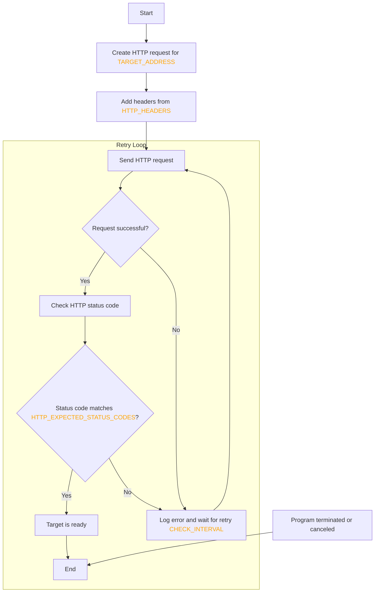
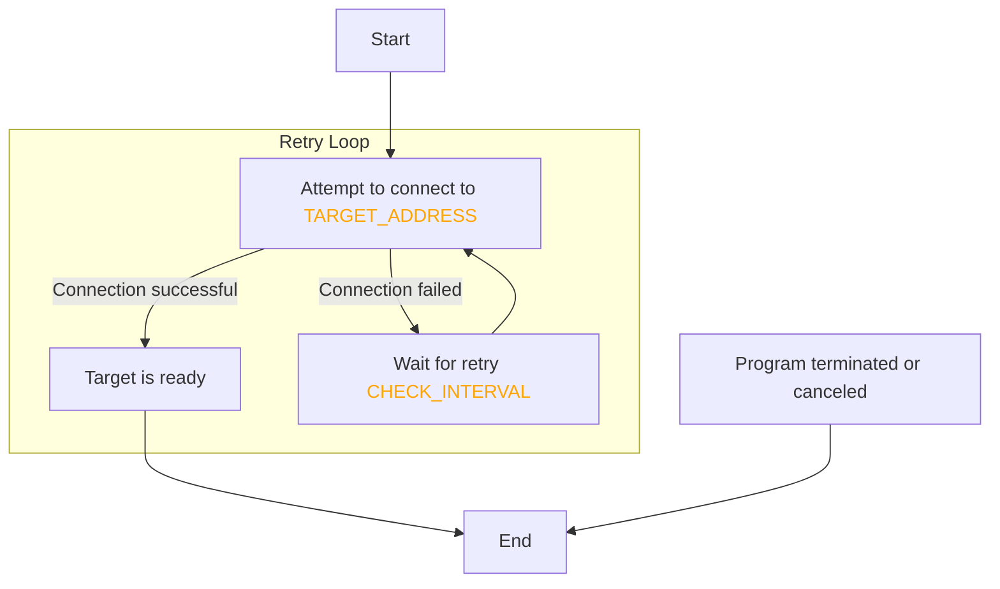

<p align="center">
  
</p>

# PortPatrol

`PortPatrol` is a simple Go application with zero external dependencies that checks if a specified `TCP` or `HTTP` target is available. It continuously attempts to connect to the specified target at regular intervals until the target becomes available or the program is terminated.

## How It Works

`PortPatrol` performs the following steps:

- **Configuration**: The application is configured using environment variables, allowing flexibility and easy integration into various environments like Docker or Kubernetes.
- **Target Connection Attempts**: It repeatedly attempts to connect to the specified `TCP` or `HTTP` target based on the configured `CHECK_INTERVAL` and `DIAL_TIMEOUT`.
- **Logging**: `PortPatrol` logs connection attempts, successes, and failures. You can enable additional logging fields to include more context in the logs.
- **Exit Status**:

  - If the target becomes available, `PortPatrol` exits with a status code of `0` (success).
  - If the program is terminated before the target is ready, it exits with a non-zero status code, typically `1`, indicating failure or interruption.

## Environment Variables

`PortPatrol` accepts the following environment variables:

### Common Variables

- `TARGET_NAME`: Name assigned to the target (optional, default: inferred from `TARGET_ADDRESS`). If not specified, it's derived from the target address. For example, `http://postgres.default.svc.cluster.local:5432` is inferred as `postgres.default.svc.cluster.local`.
- `TARGET_ADDRESS`: The target's address in the following formats:
  - **TCP**: `host:port` (required). If using the `tcp://` scheme, `TARGET_CHECK_TYPE` can be omitted.
  - **HTTP**: `scheme://host:port` (required).
- `TARGET_CHECK_TYPE`: Specifies the type of check (`tcp` or `http`). The check type is inferred from the scheme in `TARGET_ADDRESS`. If no scheme is provided, it defaults to `tcp`.
- `CHECK_INTERVAL`: Time between connection attempts (optional, default: `2s`).
- `DIAL_TIMEOUT`: Maximum allowed time for each connection attempt (optional, default: `1s`).
- `LOG_EXTRA_FIELDS`: Enable logging of additional fields (optional, default: `false`).

### HTTP-Specific Variables

- `HTTP_METHOD`: HTTP method to use (optional, default: `GET`).
- `HTTP_HEADERS`: Comma-separated list of HTTP headers in `key=value` format (optional). Examples:
  - `Authorization=Bearer token`
  - `Content-Type=application/json,Accept=application/json`
- `HTTP_ALLOW_DUPLICATE_HEADERS`: Allow duplicate headers (optional, default: `false`).
- `HTTP_EXPECTED_STATUS_CODES`: Comma-separated list of expected HTTP status codes or ranges (optional, default: `200`). You can specify individual status codes or ranges:
  - `200,301,404`
  - `200,300-302`
  - `200,301-302,404,500-502`
- `HTTP_PROXY`: HTTP proxy to use (optional).
- `HTTPS_PROXY`: HTTPS proxy to use (optional).
- `NO_PROXY`: Comma-separated list of domains to exclude from proxying (optional).

## Behavior Flowchart

### HTTP Check



### TCP Check



## Logging

With the `LOG_EXTRA_FIELDS` environment variable set to true, additional fields will be logged.

### With additional fields

```text
ts=2024-07-05T13:08:20+02:00 level=INFO msg="Waiting for PostgreSQL to become ready..." dial_timeout="1s" interval="2s" target_address="postgres.default.svc.cluster.local:5432" target_name="PostgreSQL" version="0.0.22"
ts=2024-07-05T13:08:21+02:00 level=WARN msg="PostgreSQL is not ready ✗" dial_timeout="1s" error="dial tcp: lookup postgres.default.svc.cluster.local: i/o timeout" interval="2s" target_address="postgres.default.svc.cluster.local:5432" target_name="PostgreSQL" version="0.0.22"
ts=2024-07-05T13:08:24+02:00 level=WARN msg="PostgreSQL is not ready ✗" dial_timeout="1s" error="dial tcp: lookup postgres.default.svc.cluster.local: i/o timeout" interval="2s" target_address="postgres.default.svc.cluster.local:5432" target_name="PostgreSQL" version="0.0.22"
ts=2024-07-05T13:08:27+02:00 level=WARN msg="PostgreSQL is not ready ✗" dial_timeout="1s" error="dial tcp: lookup postgres.default.svc.cluster.local: i/o timeout" interval="2s" target_address="postgres.default.svc.cluster.local:5432" target_name="PostgreSQL" version="0.0.22"
ts=2024-07-05T13:08:27+02:00 level=INFO msg="PostgreSQL is ready ✓" dial_timeout="1s" error="dial tcp: lookup postgres.default.svc.cluster.local: i/o timeout" interval="2s" target_address="postgres.default.svc.cluster.local:5432" target_name="PostgreSQL" version="0.0.22"
```

### Without additional fields

```text
time=2024-07-12T12:44:41.494Z level=INFO msg="Waiting for PostgreSQL to become ready..."
time=2024-07-12T12:44:41.512Z level=WARN msg="PostgreSQL is not ready ✗"
time=2024-07-12T12:44:43.532Z level=WARN msg="PostgreSQL is not ready ✗"
time=2024-07-12T12:44:45.552Z level=INFO msg="PostgreSQL is ready ✓"
```

## Kubernetes initContainer Configuration

Configure your Kubernetes deployment to use this init container:

```yaml
initContainers:
  - name: wait-for-valkey
    image: ghcr.io/containeroo/portpatrol:latest
    env:
      - name: TARGET_ADDRESS
        value: valkey.default.svc.cluster.local:6379
  - name: wait-for-postgres
    image: ghcr.io/containeroo/portpatrol:latest
    env:
      - name: TARGET_NAME
        value: PostgreSQL
      - name: TARGET_ADDRESS
        value: postgres.default.svc.cluster.local:5432
      - name: TARGET_CHECK_TYPE
        value: tcp # Specify the type of check, either tcp or http
      - name: CHECK_INTERVAL
        value: "5s" # Specify the interval duration, e.g., 2 seconds
      - name: DIAL_TIMEOUT
        value: "5s" # Specify the dial timeout duration, e.g., 2 seconds
      - name: LOG_EXTRA_FIELDS
        value: "true"
  - name: wait-for-webapp
    image: ghcr.io/containeroo/portpatrol:latest
    env:
      - name: TARGET_NAME
        value: webapp
      - name: TARGET_ADDRESS
        value: webapp.default.svc.cluster.local:8080
      - name: TARGET_CHECK_TYPE
        value: http # Specify the type of check, either tcp or http
      - name: HTTP_METHOD
        value: "GET"
      - name: HTTP_HEADERS
        value: "AuPortPatrolization=Bearer token"
      - name: HTTP_EXPECTED_STATUS_CODES
        value: "200,202"
      - name: CHECK_INTERVAL
        value: "2s" # Specify the interval duration, e.g., 2 seconds
      - name: DIAL_TIMEOUT
        value: "2s" # Specify the dial timeout duration, e.g., 2 seconds
      - name: LOG_EXTRA_FIELDS
        value: "true"
```

## Usage Scenarios

- Kubernetes initContainers: Use `PortPatrol` to delay the start of a service until its dependencies are ready, ensuring reliable startup sequences.
- Startup Scripts: Include `PortPatrol` in deployment scripts to ensure that services wait for dependencies before proceeding.
- CI/CD Pipelines: Use `PortPatrol` in CI/CD pipelines to wait for services to be ready before running integration tests.
