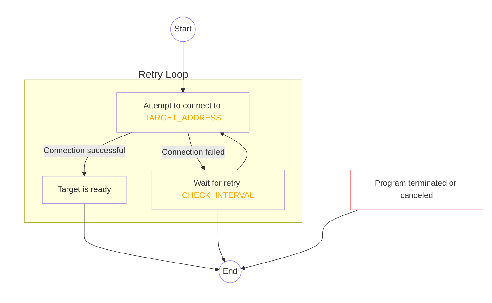
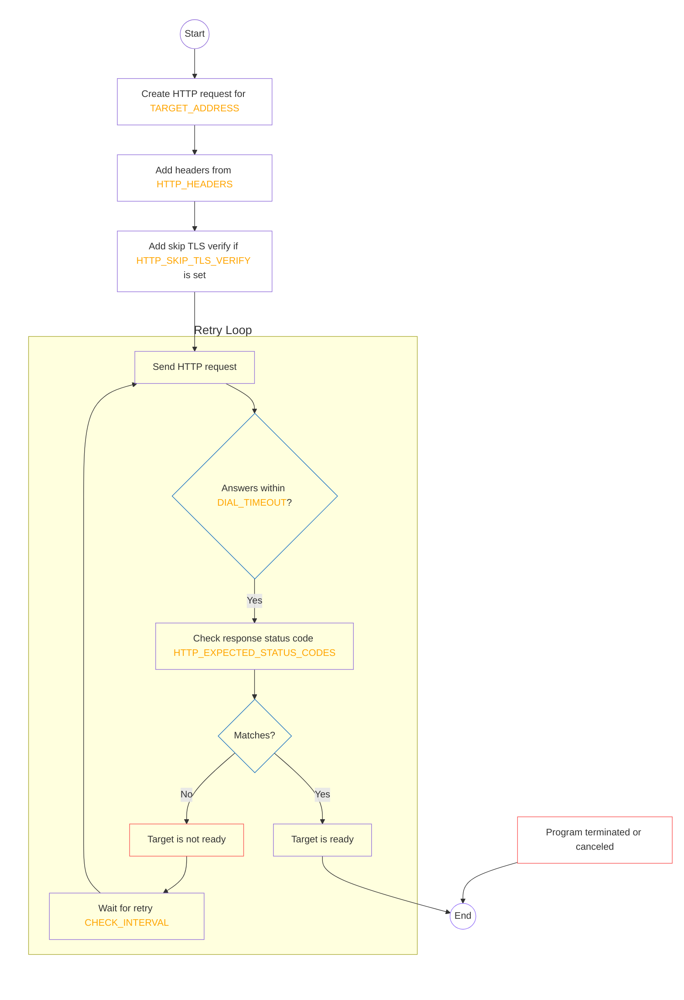
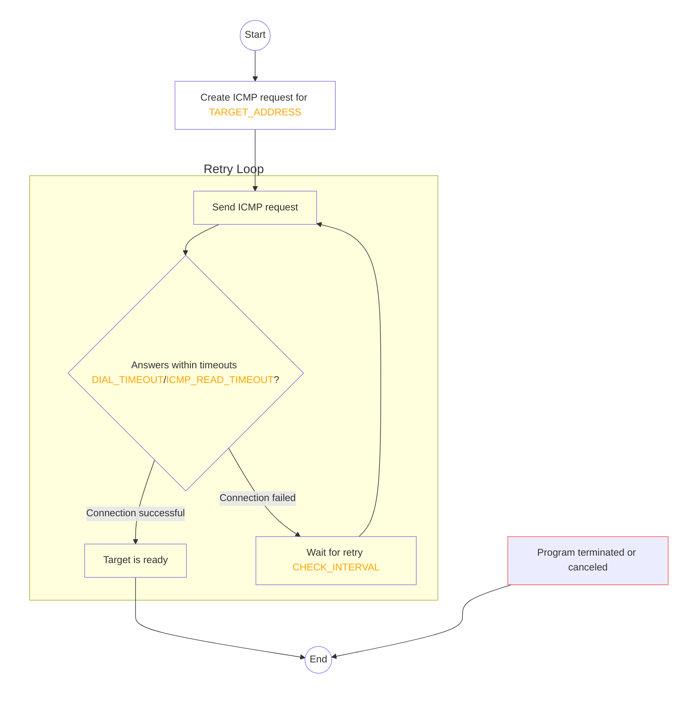

<p align="center">
  
</p>

# PortPatrol

`PortPatrol` is a simple Go application that checks if a specified `TCP`, `HTTP` or `ICMP` target is available. It continuously attempts to connect to the specified target at regular intervals until the target becomes available or the program is terminated. Intended to run as a Kubernetes initContainer, `PortPatrol` helps verify whether a dependency is ready. The configuration is done through startup arguments.
You can check multiple targets at once.


## Command-Line Flags

`PortPatrol` accepts the following command-line flags:

### Common Flags

| Flag                  | Type     | Default | Description                                                                                   |
|-----------------------|----------|---------|-----------------------------------------------------------------------------------------------|
| `--default-interval`  | duration | `2s`    | Default interval between checks. Can be overridden for each target.                           |
| `--debug`             | bool     | `false` | Enable logging of additional fields.                                                         |
| `--version`           | bool     | `false` | Show version and exit.                                                                        |
| `--help`, `-h`        | bool     | `false` | Show help.                                                                                    |

### Target Flags

`PortPatrol` accepts "dynamic" flags that can be defined in the startup arguments.
Use the `--<TYPE>.<IDENTIFIER>.<PROPERTY>=<VALUE>` format to define targets.
Types are: `http`, `icmp` or `tcp`.

#### HTTP-Flags

- **`--http.<IDENTIFIER>.name`** = `string`
  The name of the target. If not specified, it uses the `<IDENTIFIER>` as the name.

- **`--http.<IDENTIFIER>.address`** = `string`
  The target's address.
  **Resolvable:** Use `env:ENV_VAR` or `file:path/to/file.txt` to resolve the value from a environment variable or a file. See below.

  - **`--http.<IDENTIFIER>.interval`** = `duration`
  The interval between HTTP requests (e.g., `1s`). Overwrites the global `--default-interval`.

- **`--http.<IDENTIFIER>.method`** = `string`
  The HTTP method to use (e.g., `GET`, `POST`). Defaults to `GET`.

- **`--http.<IDENTIFIER>.header`** = `string`
  A HTTP header in `key=value` format. Can be specified multiple times.
  **Example:** `Authorization=Bearer token`
  **Resolvable:** The value of the Header is resolvable: `env:ENV_VAR`, `file:path/to/file.txt`. see below.

- **`--http.<IDENTIFIER>.allow-duplicate-headers`** = `bool`
  Allow duplicate headers. Defaults to `false`.

- **`--http.<IDENTIFIER>.expected-status-codes`** = `string`
  A comma-separated list of expected HTTP status codes or ranges (e.g., `200,301-302`). Defaults to `200`.

- **`--http.<IDENTIFIER>.skip-tls-verify`** = `bool`
  Whether to skip TLS verification. Defaults to `false`.

- **`--http.<IDENTIFIER>.timeout`** = `duration`
  The timeout for the HTTP request (e.g., `5s`). Defaults to `1s`.

#### ICMP Flags

- **`--icmp.<IDENTIFIER>.name`** = `string`
  The name of the target. If not specified, it uses the `<IDENTIFIER>` as the name.

- **`--icmp.<IDENTIFIER>.address`** = `string`
  The target's address.
  **Resolvable:** Use `env:ENV_VAR` or `file:path/to/file.txt` to resolve the value from a environment variable or a file. See below.

- **`--icmp.<IDENTIFIER>.interval`** = `duration`
  The interval between ICMP requests (e.g., `1s`). Overwrites the global `--default-interval`.

- **`--icmp.<IDENTIFIER>.read-timeout`** = `duration`
  The read timeout for the ICMP connection (e.g., `1s`). Defaults to `1s`.

- **`--icmp.<IDENTIFIER>.write-timeout`** = `duration`
  The write timeout for the ICMP connection (e.g., `1s`).Defaults to `1s`.

### TCP Flags

- **`--tcp.<IDENTIFIER>.name`** = `string`
  The name of the target. If not specified, it uses the `<IDENTIFIER>` as the name.

- **`--tcp.<IDENTIFIER>.address`** = `string`
  The target's address.
  **Resolvable:** Use `env:ENV_VAR` or `file:path/to/file.txt` to resolve the value from a environment variable or a file. See below.

- **`--tcp.<IDENTIFIER>.interval`** = `duration`
  The interval between ICMP requests (e.g., `1s`). Overwrites the global `--default-interval`.

### Resolving variables

Each `address` field can be resolved using environment variables, files, or plain text:

- **Plain Text**: Simply input the credentials directly in plain text.
- **Environment Variable**: Use the `env:` prefix, followed by the name of the environment variable that stores the credentials.
- **File**: Use the `file:` prefix, followed by the path of the file that contains the credentials. The file should contain only the credentials.

In case the file contains multiple key-value pairs, the specific key for the credentials can be selected by appending `//KEY` to the end of the path. Each key-value pair in the file must follow the `key = value` format. The system will use the value corresponding to the specified `//KEY`.

HTTP headers values can also be resolved using the same mechanism, (from a environment variable `--http.<IDENTIFIER>.header="header=env:SECRET_HEADER"` or from a file `--http.<IDENTIFIER>.header="header=file:PATH_TO_FILE"`).

### Examples

#### Define an HTTP Target

```sh
portpatrol \
  --http.web.address=http://example.com:80 \
  --http.web.method=GET \
  --http.web.expected-status-codes=200,204 \
  --http.web.header="Authorization=Bearer token" \
  --http.web.header="Content-Type=application/json" \
  --http.web.skip-tls-verify=false \
  --default-interval=5s \
  --debug
```

#### Define Multiple Targets (HTTP and TCP) Running in Parallel

```sh
portpatrol \
  --http.web.address=http://example.com:80 \
  --tcp.db.address=tcp://localhost:5432 \
  --default-interval=10s
```

#### Notes

**Proxy Settings**: Proxy configurations (`HTTP_PROXY`, `HTTPS_PROXY`, `NO_PROXY`) are managed via environment variables.

## Behavior Flowchart

### TCP Check

<details>
  <summary>Click here to see the flowchart</summary>



</details>

## Permissions

**Only** when using `ICMP` checks in Kubernetes, it's important to ensure that the container has the necessary permissions to send ICMP packets. It is necessary to add the `CAP_NET_RAW` capability to the container's security context.

Example:

```yaml
- name: wait-for-host
  image: ghcr.io/containeroo/portpatrol:latest
  env:
    - name: TARGET_ADDRESS
      value: icmp://hostname.domain.com
  securityContext:
    readOnlyRootFilesystem: true
    allowPrivilegeEscalation: false
    capabilities:
      add: ["CAP_NET_RAW"]
```

For `TCP` and `HTTP` checks, the container does not require any additional permissions.

### HTTP Check

<details>
  <summary>Click here to see the flowchart</summary>



</details>

### ICMP Check

<details>
  <summary>Click here to see the flowchart</summary>



</details>

## Kubernetes initContainer Configuration

Configure your Kubernetes deployment to use this init container:

```yaml
initContainers:
  - name: wait-for-vm
    image: ghcr.io/containeroo/portpatrol:latest
    args:
      - --icmp.vm.address=hostname.domain.tld
    securityContext: # icmp requires CAP_NET_RAW
      readOnlyRootFilesystem: true
      allowPrivilegeEscalation: false
      capabilities:
        add: ["CAP_NET_RAW"]
  - name: wait-for-it
    image: ghcr.io/containeroo/portpatrol:latest
    args:
      - --target.postgres.address=postgres.default.svc.cluster.local:9000/healthz # use healthz endpoint to check if postgres is ready
      - --target.postgres.method=POST
      - --target.postgres.header=Authorization=env:BEARER_TOKEN
      - --target.postgres.expected-status-codes=200,202
      - --target.redis.name=redis
      - --target.redis.address=redis.default.svc.cluster.local:6437
      - --tcp.vaultkey.address=valkey.default.svc.cluster.local:6379
      - --tcp.vaultkey.interval=5s
      - --tcp.vaultkey.timeout=5s
    envFrom:
      - secretRef:
          name: bearer-token

```
