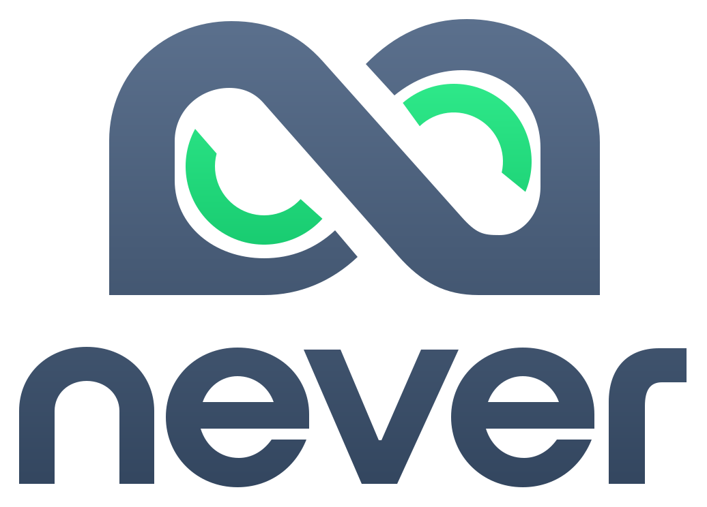

<p align="center">
  
</p>

[](https://pkg.go.dev/github.com/containeroo/never)
[](https://github.com/containeroo/never/releases/latest)
[](https://github.com/containeroo/never/actions/workflows/tests.yml)
[](https://github.com/containeroo/never/actions/workflows/lint.yml)
[](https://github.com/containeroo/never/actions/workflows/build.yml)
[](LICENSE)

**Network Endpoint Validation with Endless Retries** is a small readiness checker for HTTP, TCP, and ICMP targets. It waits for every configured dependency before exiting successfully, making it especially useful as a Kubernetes init container.

## Why N.E.V.E.R.?

- Check multiple HTTP, TCP, and ICMP targets concurrently.
- Configure each target independently with flags or environment variables.
- Retry indefinitely or stop after a configured number of attempts.
- Use linear or exponential backoff.
- Run as a compact container with no service dependencies.

## Quick start

```sh
docker run --rm ghcr.io/containeroo/never:latest \
  --http.web.address=https://example.com \
  --tcp.database.address=database.example.com:5432
```

Target flags follow this pattern:

```text
--<TYPE>.<IDENTIFIER>.<PROPERTY>=<VALUE>
```

The equivalent environment variable starts with `NEVER__`:

```text
NEVER__HTTP_WEB_ADDRESS=https://example.com
```

## Kubernetes

```yaml
initContainers:
  - name: wait-for-dependencies
    image: ghcr.io/containeroo/never:latest
    args:
      - --http.api.address=http://api.default.svc.cluster.local/healthz
      - --tcp.database.address=postgres.default.svc.cluster.local:5432
```

## Documentation

Read the complete configuration and deployment guide at **[containeroo.github.io/never](https://containeroo.github.io/never/)**.

The documentation favicon comes from `docs/assets/logo.svg`. After changing the logo, run `make site-favicon` (requires ImageMagick's `magick` command). This copies the SVG to `docs/content/assets/favicon.svg` and generates `docs/content/favicon.ico` with 16, 32, 48, 64, 128, and 256 pixel sizes. To use another SVG, run `make site-favicon SITE_LOGO=path/to/logo.svg`.

Keep both generated icons in the documentation source and commit them so CI can copy them into the site without ImageMagick. Run `make site` to build or `make site-serve` to preview locally (also requires Python 3). Both targets automatically download the pinned Lore release for your platform into `bin/`, verify its SHA-256 checksum, and reuse it on subsequent builds. Run `make lore` to download it separately. Downloads require `curl`, `tar`, and either `sha256sum` or `shasum`; macOS and Linux on AMD64 and ARM64 are supported. To use an existing binary elsewhere, pass `LORE=/path/to/lore`. CI uses the same Makefile installation. The branding settings in `docs/lore-site.toml` select the header logo, browser icons, and extra assets. These settings require a Lore build that supports configurable branding.

## License

Licensed under the [Apache License 2.0](LICENSE).
